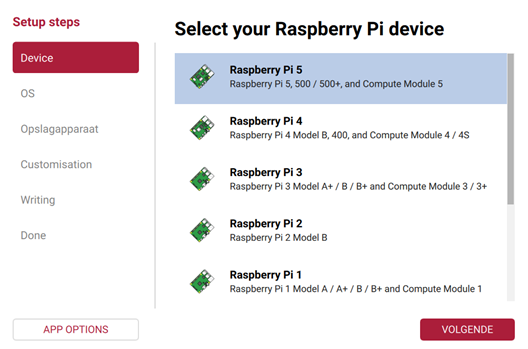
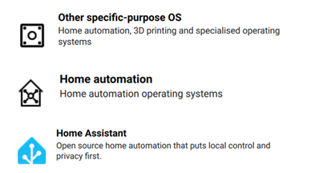
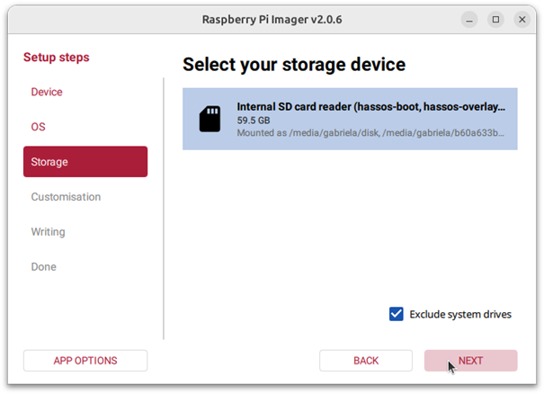
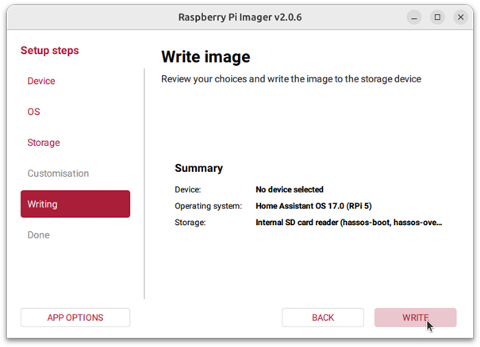

# HomeAssistant installeren op Raspberry Pi
## Inhoud

In dit document zal stap voor stap uitgelegd worden hoe wij HomeAssistant op een Raspberry Pi hebben gezet.

## Benodigdheden

- Raspberry Pi (wij gebruikten versie 5)

- Power supply

- Micro SD card (min. 32 GB)

- SD card lezer

- Ethernet kabel

- Laptop

## Uitvoering

### Installeren op Raspberry Pi

1. Als de Raspberry Pi Imager nog niet geïnstalleerd is, download en installeer deze dan op uw computer zoals beschreven onder [https://www.raspberrypi.com/software/](https://www.raspberrypi.com/software/).

2. Onder device selecteer het toestel die u zal gebruiken (in ons geval versie 5).
   

   

3. Klik daarna op volgende.
   

   

4. Selecteer **Other specific-purpose OS** > **Home automation** > **Home Assistant**.
   

   

5. Kies het Home Assistant-besturingssysteem dat overeenkomt met het gebruikte hardware (voor ons RPi 5).

6. Kies de opslagplaats:

- Plaats de SD-kaart in de computer. Wees zeker dat de inhoud weg mag want de **inhoud** van de kaart wordt **overschreven**.

- Selecteer uw SD-kaart.
  

   

7. Schrijf het installatieprogramma naar de SD-kaart:

- Om het proces te starten, selecteert u **Volgende** en vervolgens **Schrijven**.

- Wacht tot het Home Assistant OS naar de SD-kaart is geschreven.
  

   

8. Selecteer **Finish** en werp de SD kaart uit.

### Opstarten Raspberry Pi

- Plaats de SD-kaart in uw Raspberry Pi.

- Sluit een ethernetkabel aan en zorg ervoor dat de Raspberry Pi is aangesloten op hetzelfde netwerk als uw computer en verbinding heeft met internet.

- Sluit de voeding aan om het apparaat op te starten.

### Toegang tot HomeAssistant

Binnen enkele minuten na het aansluiten van de Raspberry Pi kunt kan het nieuwe Home Assistant bereikt worden.

Er zijn 2 manieren om op de pagina te geraken.

1. Voer in de browser van uw desktopsysteem [homeassistant.local:8123](http://homeassistant.local:8123/) in.

	Op deze manier kan je echter op een verkeerde pagina terecht komen (van een ander toestel).

2. Om zeker te zijn dat de juiste pagina wordt bereikt vul dan http://X.X.X.X:8123 (vervang X.X.X.X door het IP-adres van je Raspberry Pi) in een browser.

Om het IP-adres van je Raspberry Pi uit te lezen gebruik je een HDMI kabel en verbind u deze met de Raspberry Pi en een monitor. Na een aantal seconden zou de console output van de Raspberry Pi zichtbaar moeten worden. Hierbij staat ook het IP-adres.

**Bronnen:**

Handleiding

[Raspberry Pi - Home Assistant](https://www.home-assistant.io/installation/raspberrypi/)