# Gebruikershandleiding

## Inhoudstafel 
[**Inleiding**](#inleiding) 
[**Installatie systemen**](#installatie) 
- [**Installatie knop**](#knop) 
- [**Installatie applicatie**](#applicatie) 

[**Gebruik knop**](#gebruik-knop) 
[**Gebruik app/website**](#gebruik-app_website) 
[**Gebruik signalisatie lamp**](#gebruik-signalisatie-lamp) 
[**Onderhoud lamp en knop**](#onderhoud) 
[**FAQ**](#faq) 

## Inleiding
Dit bestand bevat een uitgebreide handleiding bestemd voor de gebruiker van het systeem, er zullen geen technische details of diepgang voorkomen. Er zal gesproken worden over de installatie, gebruik, onderhoud en FAQ.

## Installatie
### **Knop**
De knop installeren gebeurt heel eenvoudig.
1.	Steek de knophouder in het gat van de oranje schijf.
2.	Klik de knop op de schijf met behulp van de ingebouwde magneet.
3.	Schuif de knophouder over de afstandsbediening van het bed of over andere passende objecten, er kan ook gebruik gemaakt worden van een koord.
4.	De knop zou standaard al in het systeem moeten zitten waardoor deze meteen bruikbaar zou moeten zijn, indien dit niet gebeurt druk dan op de kleine pairing knop aan de zijkant van de knop zelf.

### **Applicatie**
De applicatie installeren gebeurt heel eenvoudig.
1. Surf naar [verpleegkunde.voltlab.net](https://verpleegkunde.voltlab.net) op een browser applicatie.
2. Log in (hoofdstuk Inloggen). 
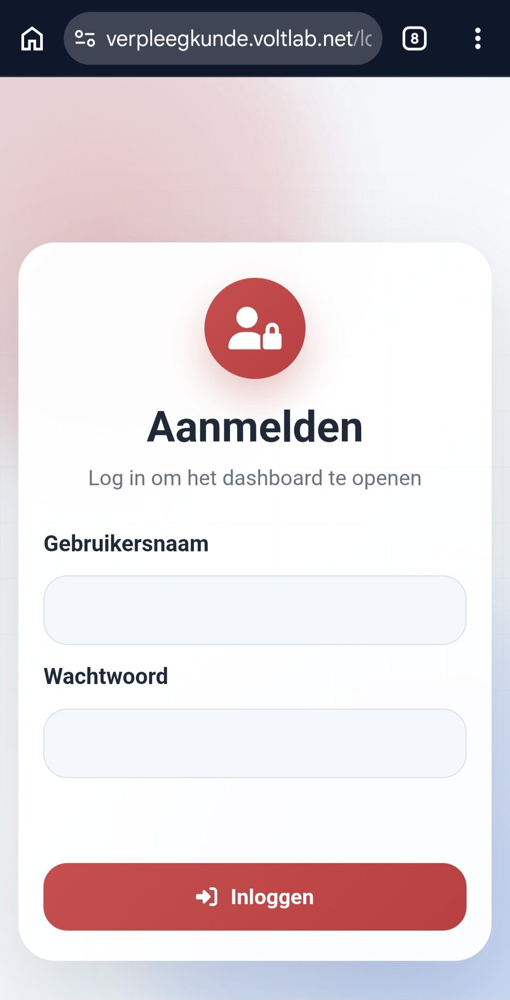
3. Druk op de drie puntjes rechtsboven. 
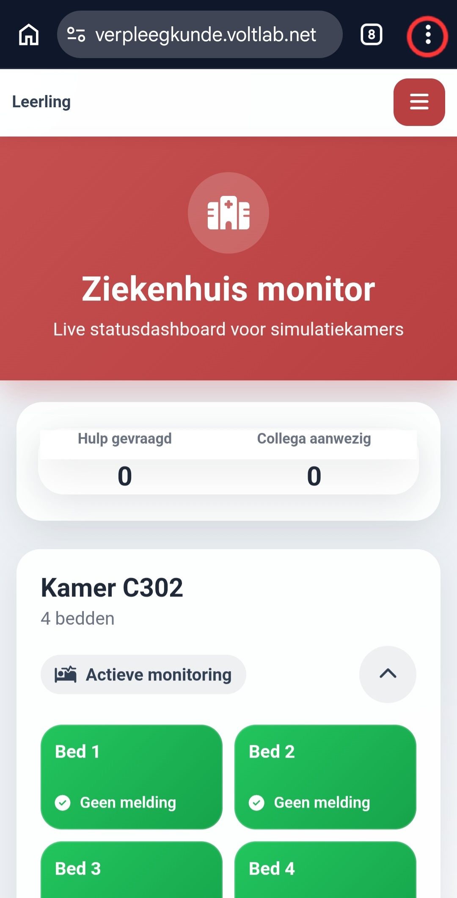
4. Druk op toevoegen aan startscherm, dit zou de installatie moeten starten.
 
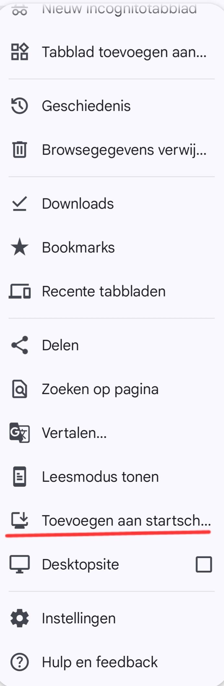
5. Nu moet onderstaand icoon zichtbaar moeten zijn op het startscherm.
 
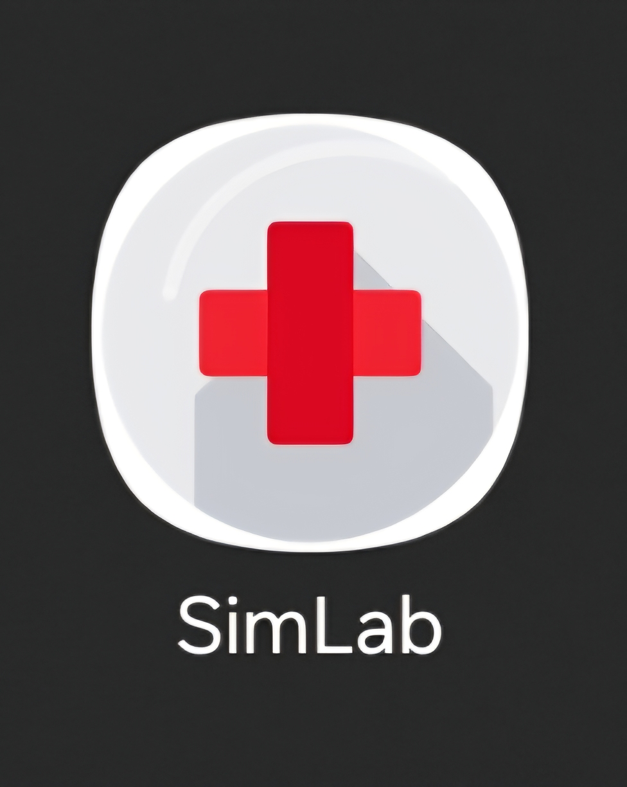

## Gebruik knop
Bij iedere melding of verandering in de app, krijgt iedere medewerker (docent en student) die op dat moment zijn ingelogd een bijhorende melding.

### **Meldingen patiënt**
#### **Hulp gevraagd**
Wanneer de patiënt hulp nodig heeft drukt deze **1x kort** op de knop.

Dit zorgt ervoor dat het bijhorende bed op de app rood kleurt, deze als “Hulp gevraagd” geregistreerd wordt en indien er geen belangrijkere meldingen zijn zal de lamp van de kamer rood kleuren.

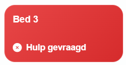 

### **Personeel (medewerker)**
#### **Aanwezigheid registreren**
Als de medewerker aanwezigheid wilt registreren wanneer er voordien hulp gevraagd werd, kan dit door **2x kort na elkaar** op de knop te drukken waar de melding vandaan kwam.

Dit zorgt ervoor dat het bijhorende bed op de app van rood naar oranje kleuren, deze als “Collega aanwezig” geregistreerd wordt en indien er geen belangrijkere meldingen zijn zal de lamp van de kamer oranje kleuren.

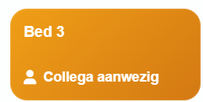 

#### **Uitschakelen**
Als de medewerker de melding wilt afhandelen of uitschakelen kan dit door **1x kort** op de bijhorende knop te drukken (enkel als deze al brand anders wordt er om hulp gevraagd).

Hierdoor zal het bijhorende bed op de app terug groen kleuren en de lamp van de bijhorende kamer uitgeschakeld worden indien er geen andere meldingen zijn.

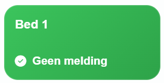 

#### **Extra hulp nodig**
Als de medewerker **1x lang** de knop indrukt (ongeveer 2s-3s), zal er een extra hulp aanvraag verzonden worden.
Ook als er meer dan één "Hulp gevraagd" meldingen in een kamer zijn zal automatisch extra hulp opgeroepen worden.

Dit zorgt ervoor dat het bijhorende bed op de app blauw brand, deze als “Extra hulp nodig” geregistreerd wordt en de lamp van de bijhorende kamer blauw kleurt.

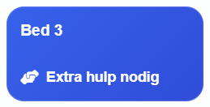 

**Instructieblad:**

 

## Gebruik app_website
Bij ons systeem hoort een website en een app die een overzicht geven van de meldingen, status van kamers met bedden en het mogelijk maakt om meldingen te ontvangen.
Bij iedere melding of verandering in de app, krijgt iedere medewerker (docent en student) die op dat moment zijn ingelogd een bijhorende melding.
### **Inloggen**
Als u surft naar https://verpleegkunde.voltlab.net of de applicatie opent komt u op onderstaand scherm terecht.
 
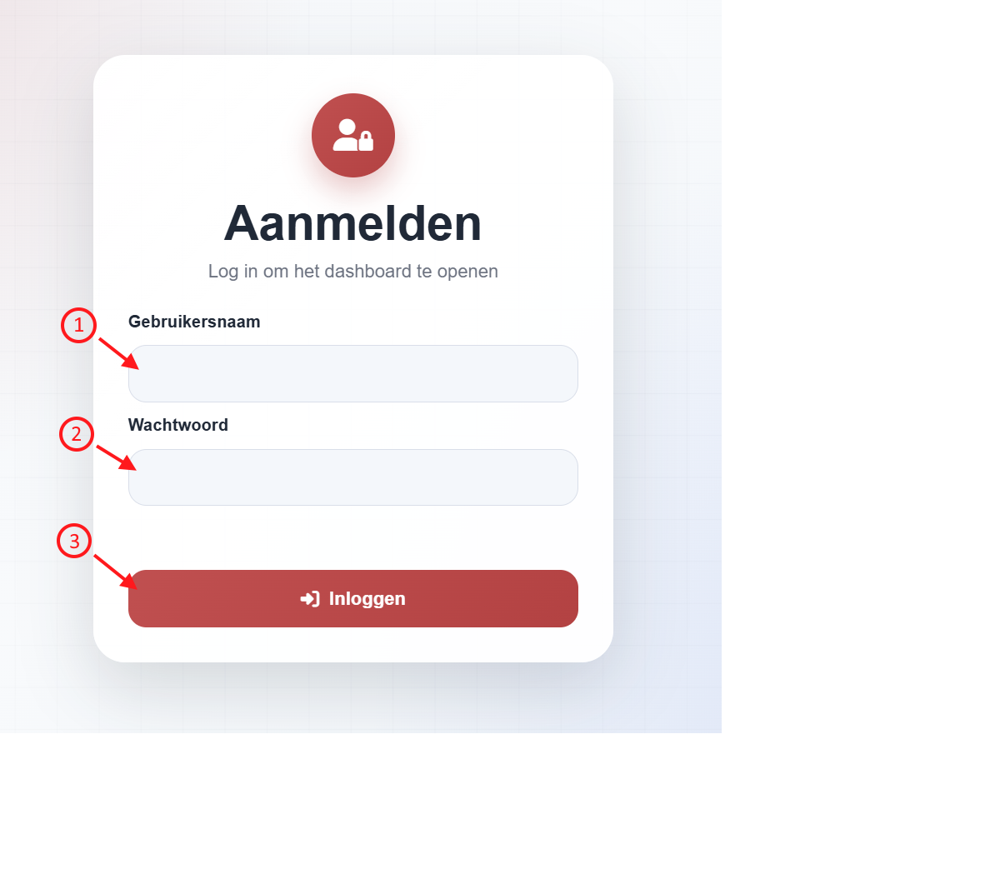

1.  In het vak “Gebruikersnaam” vult u een bestaande gebruikersnaam in. Indien u een leerling bent vult u “Leerling” in, indien u een leerkracht bent vult u “Leerkracht” in.

2.  In het vak “Wachtwoord” vult u een correct wachtwoord in. Indien u een leerling bent krijgt u deze van uw leerkracht.

3.  Wanneer alles ingevuld is mag op de “Inloggen” knop gedrukt worden. 
**OPGELET: Het inloggen is hoofdletter gevoelig.**

### **Overzicht (leerling)**
Wanneer u ingelogd bent als leerling krijgt u onderstaand overzicht.

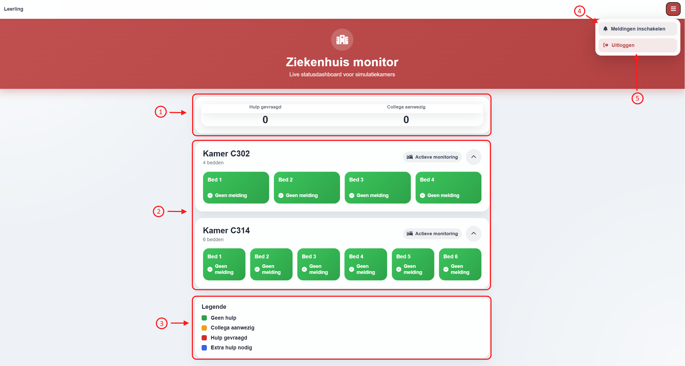 
 
1.  **Overzicht aanvragen:** Hier is de totale som van alle aanvragen te zien. De hoeveelheid “Hulp gevraagd” en “Collega aanwezig” meldingen zijn hier terug te vinden.

2.  **Overzicht kamers:** Hier is een overzichtelijke weergave van de kamers terug te vinden. Per kamer en per bed zijn er vakken voorzien, deze veranderen van kleur en melding afhankelijk van het gebruik van de bijhorende knop. Op deze manier is alles makkelijk bij te houden.

3.  **Legende:** Een kleuren legende met informatie over de meldingen.

4.  **Meldingen inschakelen:** Deze knop moet ingedrukt worden om notificaties op een telefoon of andere toestellen te kunnen ontvangen. 
**OPGELET: Het is enkel mogelijk om notificaties te ontvangen met de applicatie niet met de website.**

1.  **Uitloggen:** Met deze knop kunt u uitloggen, na het uitloggen ontvangt u geen meldingen meer.

### **Overzicht (leerkracht)**
Het overzicht van een leerkracht is gelijkaardig aan dat van een leerling. Een leerkracht ziet wel de knop “Instellingen” staan onder de “Meldingen inschakelen” knop. Wanneer deze wordt ingedrukt komt u op het onderstaande menu terecht.

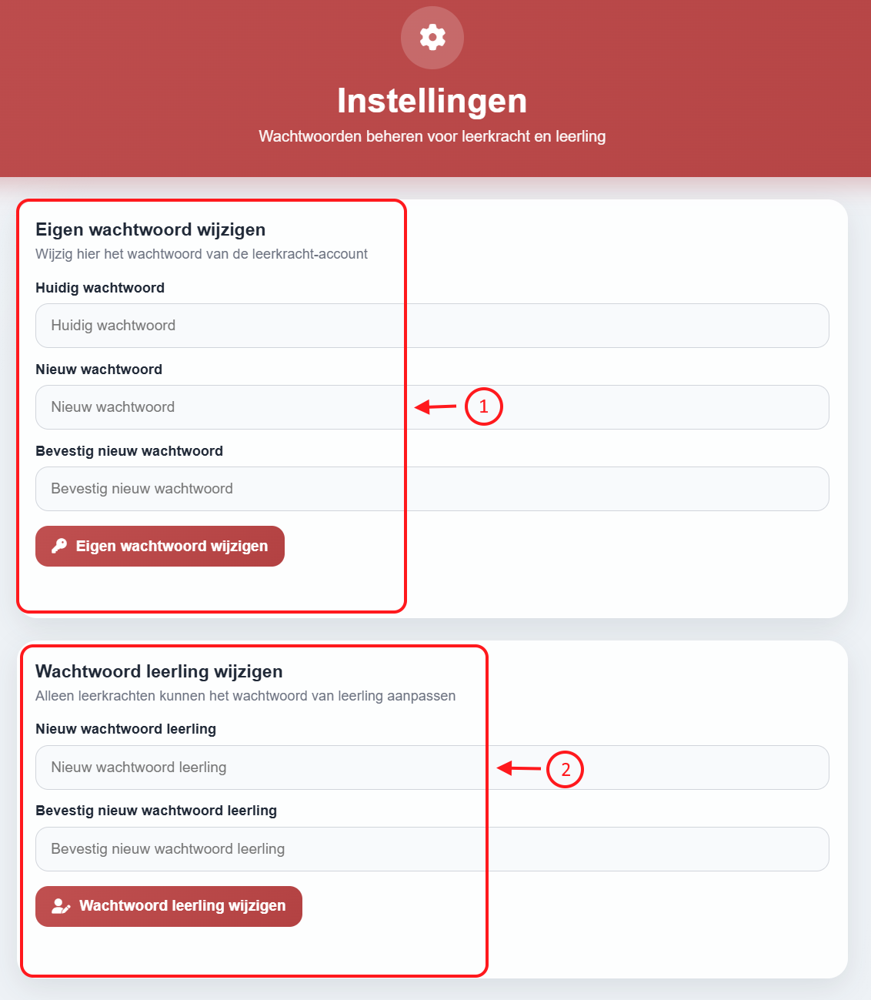 
 
1.  In deze vakken kunt u het algemeen wachtwoord voor het leerkrachten account aanpassen. Dit gebeurt door eerst het huidige wachtwoord in te vullen en daarna twee keer het nieuwe wachtwoord.

2.  In deze vakken kunt u het algemeen wachtwoord voor het leerlingen account aanpassen. Dit gebeurt door twee keer het nieuwe wachtwoord in te vullen. 
**OPGELET: De wachtwoorden zijn hoofdletter gevoelig.**

## Gebruik signalisatie lamp  

### **Aanschakelen**
Het aanschakelen van de lamp gebeurt door 1x te drukken op de power knop van de powerbank. Deze knop kan eenvoudig bereikt worden door het gat in de behuizing.
Indien u niet zeker bent of de lamp ingeschakeld is, kunt u altijd het deksel er vanaf schuiven en controleren of de lichtjes van de powerbank effectief aan zijn. 
 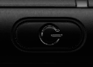
 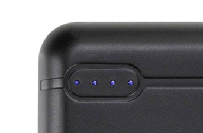

### **Uitschakelen**
Het uitschakelen van de lamp gebeurt door 2x kort achtereenvolgens op de power knop van de powerbank te drukken.
Indien u niet zeker bent of de lamp ingeschakeld is, kunt u ook weer het deksel er vanaf schuiven en controleren of de lichtjes van de powerbank effectief uit zijn. 
 
 

## Onderhoud
### **Lamp**
Aangezien de lampen werken met een powerbank, moeten deze tijdig herladen worden.

1.  Verwijder de behuizing van de muur.

2.  Verwijder het schuivende deksel van de behuizing, nu zou de powerbank zichtbaar moeten zijn.

3.  Gebruik een USB-C kabel en steek deze in de correcte poort aangeduid op de powerbank als “USB-C In/Out”.

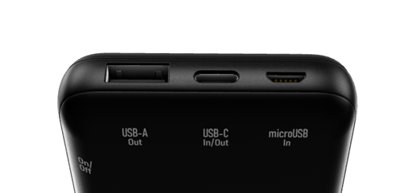

4.  Deze kabel kan nu gebruikt worden om de powerbank op te laden. U kunt de kabel makkelijker bereikbaar maken door deze door het voorziene gat in de behuizing te steken of u kunt gerust de powerbank uit de behuizing halen.

    **OPGELET: Voor het uithalen van de powerbank zijn er een aantal belangrijke handelingen nodig die behandelt worden vanaf stap 8**. 

5.  De status van het opladen kan gezien worden aan de bovenzijde van de powerbank.
 
 

6.  Als de powerbank klaar is met opladen, kunt u de kabel terug verwijderen van de poort.
   
7.  Vervolgens mag de behuizing terug gesloten worden en opgehangen worden.

8.  Als u de powerbank wilt verwijderen van de behuizing moet u eerst de al aangesloten kabel verwijderen. Deze kabel zou moeten in de “Output-A” poort moeten zitten.

9.  Vervolgens mag de powerbank uit het vak van de behuizing gehaald worden.

10. Nu kunt u deze apart opladen.

11. Wanneer deze voldoende is opgeladen kunt u deze terug steken in het daarvoor bedoelde vak in de behuizing.

12. Vervolgens mag de kabel terug in de “Output-A” poort van de powerbank gestoken worden.

    **OPGELET: Let er op dat de powerknop van de powerbank (rechter zijde) opnieuw ingedrukt is voor gebruik.**

13. Nu mag de behuizing terug gesloten en opgehangen worden.

### **Knop**
Aangezien de knoppen op een batterij werken, moeten deze tijdig vervangen worden. 
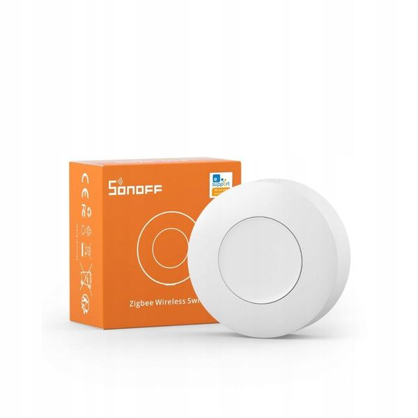 

1.  Haal de knop van de oranje magneet af.

2.  Aan de achterkant van de knop zit een gleuf.

3.  Gebruik een muntstuk of gelijkaardige voorwerpen om in de draairichting aangeduid door de pijl te draaien.

4.  Wanneer het deksel van de knop is kunt u de wegwerpbare batterij vervangen.

5.  Wanneer dit gebeurt is kunt u het deksel terug op de knop vast draaien.

6.  Vervolgens mag de knop terug aan de oranje magneet gehangen worden en is het klaar voor gebruik.

## FAQ
Q: De signalisatielamp werkt niet meer.
 
A: 
 - Controleer of de kabel van de powerbank naar de microcontroller correct is aangesloten. De kabel moet van de “Output-A” poort van de powerbank naar de “USB” poort van de microcontroller gaan.
 

Q: De knop reageert niet op de ledstrip en de website.
 
A:
- Als de knop heeft uitgestaan en dezen niet meer reageert, moet u op het kleine knopje drukken aan de zijkant op van de knop (pairing button). Als u vervolgens opnieuw probeert, zou het systeem moeten reageren. 
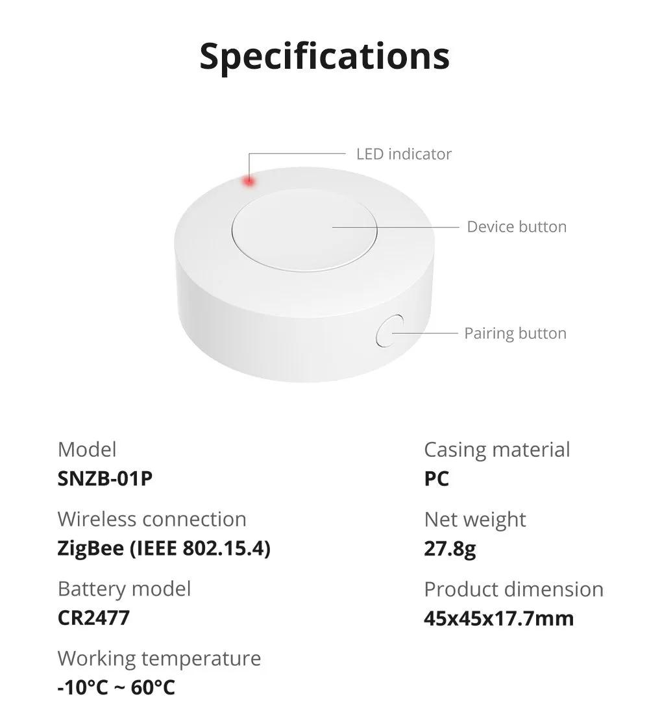
 

Q: Ik kan niet inloggen.
 
A: 
 - Controleer of u de gebruikersnaam en wachtwoord volledig correct ingeeft. Deze zijn hoofdlettergevoelig en spaties worden ook als verkeerd gezien.
 

Q: Ik krijg geen meldingen meer.
 
A: 
 - Een gebruiker kan enkel meldingen ontvangen als deze de applicatie geïnstalleerd heeft. In de applicatie zelf moet de "Meldingen inschakelen" knop zeker ingedrukt worden, wanneer deze ingedrukt is moet er op "Meldingen toestaan" gedrukt worden zodat de applicatie toestemming krijgt om meldingen te verzenden.   Indien deze oplossingen niet hielpen, kunt u altijd de applicatie opnieuw installeren.
 

