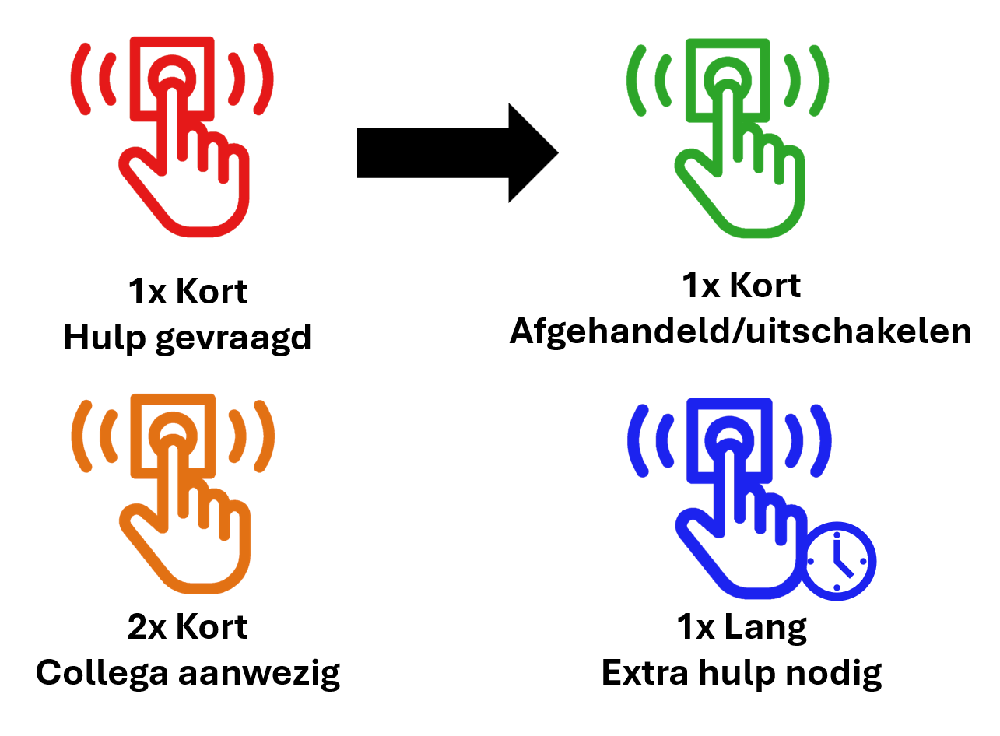

# Gebruikershandleiding

## Inleiding
Dit bestand bevat een uitgebreide handleiding bestemd voor de gebruiker van het systeem, er zullen geen technische details of diepgang voorkomen.

## Installatie

## Gebruik knop
Bij iedere melding of verandering in de app, krijgt iedere medewerker (docent en student) die op dat moment zijn ingelogd een bijhorende melding.

### Meldingen patiënt
#### Hulp gevraagd
Wanneer de patiënt hulp nodig heeft drukt deze **1x kort**op de knop.

Dit zorgt ervoor dat het bijhorende bed op de app rood kleurt, deze als “Hulp gevraagd” geregistreerd wordt en indien er geen belangrijkere meldingen zijn zal de lamp van de kamer rood kleuren.

### Personeel (medewerker)
#### Aanwezigheid registreren
Als de medewerker aanwezigheid wilt registreren wanneer er voordien hulp gevraagd werd, kan dit door **2x kort na elkaar** op de knop te drukken waar de melding vandaan kwam.

Dit zorgt ervoor dat het bijhorende bed op de app van rood naar oranje kleuren, deze als “Collega aanwezig” geregistreerd wordt en indien er geen belangrijkere meldingen zijn zal de lamp van de kamer oranje kleuren.

#### Uitschakelen
Als de medewerker de melding wilt afhandelen of uitschakelen kan dit door **1x kort** op de bijhorende knop te drukken (enkel als deze al brand anders wordt er om hulp gevraagd).

Hierdoor zal het bijhorende bed op de app terug groen kleuren en de lamp van de bijhorende kamer uitgeschakeld worden indien er geen andere meldingen zijn.

#### Extra hulp nodig
Als de medewerker **1x lang** de knop indrukt (ongeveer 2s-3s), zal er een extra hulp aanvraag verzonden worden.
Ook als er meer dan één "Hulp gevraagd" meldingen in een kamer zijn zal automatisch extra hulp opgeroepen worden.

Dit zorgt ervoor dat het bijhorende bed op de app blauw brand, deze als “Extra hulp nodig” geregistreerd wordt en de lamp van de bijhorende kamer blauw kleurt.

**Instructieblad:**

## Onderhoud
### Lamp
Zorg ervoor dat de powerbank in de behuizing regelmatig gecontroleerd wordt.

### Knop

## FAQ

