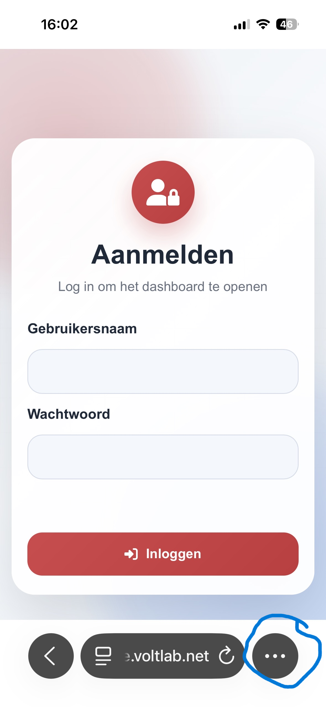
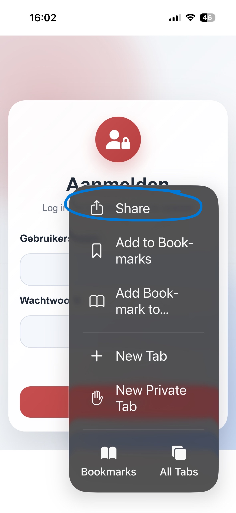
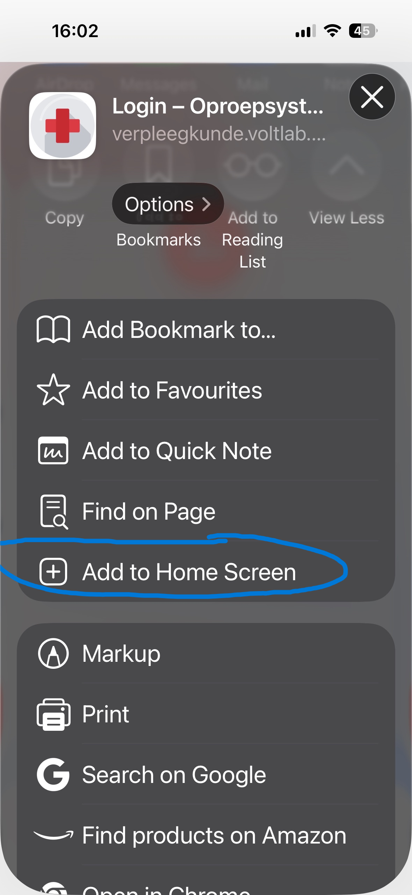
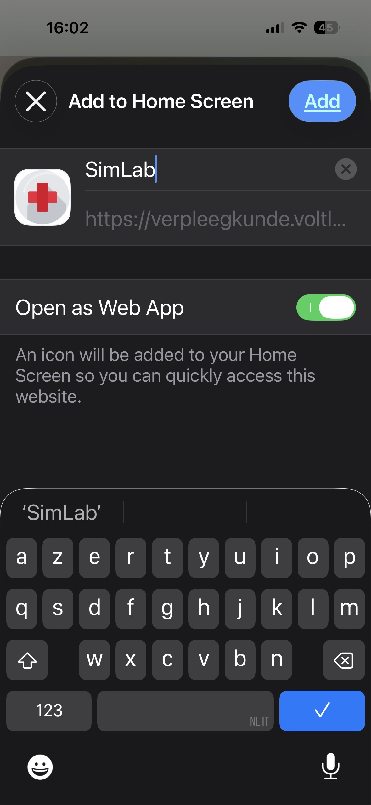
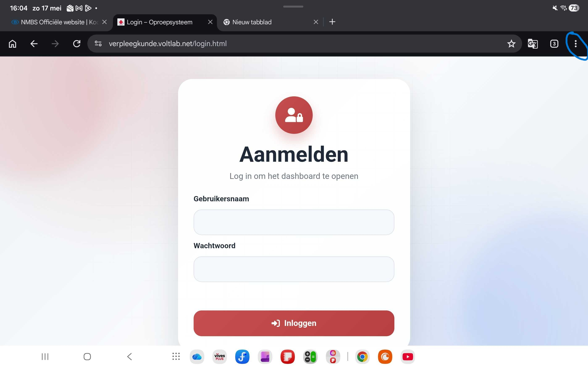
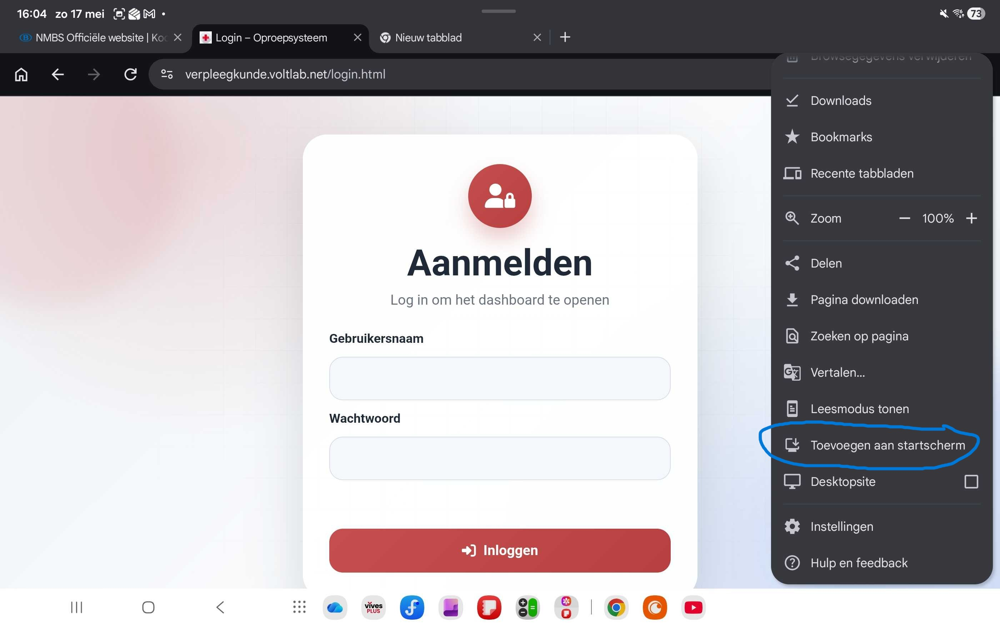
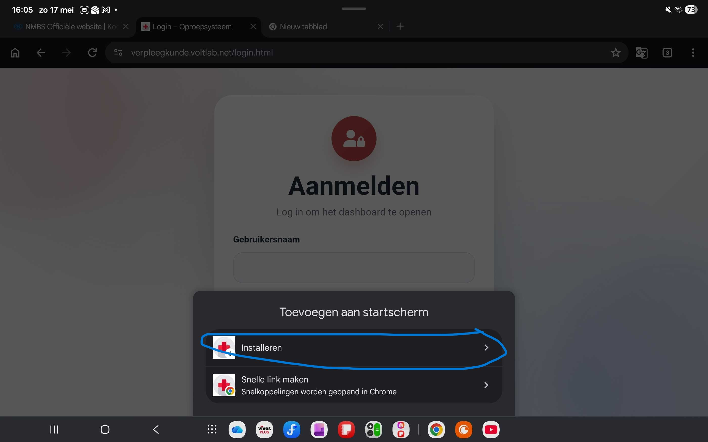
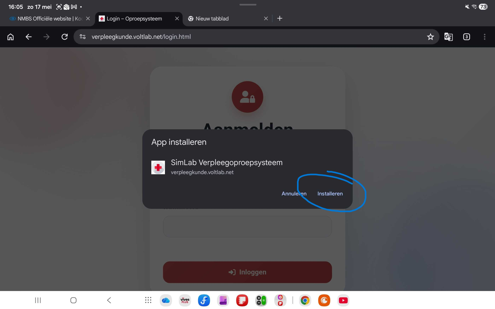

# PWA Installatiehandleiding

## Inhoudstafel
[**Inleiding**](#inleiding) 
[**Installatie op iPhone (Safari)**](#installatie-op-iphone-safari) 
[**Installatie op Android (Google Chrome)**](#installatie-op-android-google-chrome) 

---

## Inleiding
Deze handleiding legt uit hoe je de applicatie als PWA (Progressive Web App) installeert op je smartphone. Een PWA gedraagt zich als een gewone app maar wordt rechtstreeks via de browser geïnstalleerd, zonder gebruik te maken van de App Store of Google Play Store.

Volg de stappen hieronder voor jouw toestel.

---

## Installatie op iPhone (Safari)

> **Let op:** gebruik verplicht de **Safari**-browser op iPhone. Andere browsers (Chrome, Firefox, …) ondersteunen de installatie niet op iOS.

### Stap 1 — Open Safari en surf naar de link

Ga naar [https://verpleegkunde.voltlab.net/](https://verpleegkunde.voltlab.net/) in Safari.

---

### Stap 2 — Tik op de 3 bolletjes

Tik rechts onderaan (of bovenaan) in Safari op de **3 bolletjes** om het menu te openen.

---

### Stap 3 — Tik op "Delen" (Share)

Tik in het menu op **Delen** (Share).

---

### Stap 4 — Tik op "Zet op beginscherm" (Add to Home Screen)

Scroll in het deelmenu naar beneden en tik op **Zet op beginscherm** (Add to Home Screen).

---

### Stap 5 — Zet "Open as Web App" aan en geef een naam

Zet de optie **Open as Web App** aan en geef de app een naam naar keuze.

---

### Stap 6 — Tik op "Voeg toe" (Add)

Bevestig door op **Voeg toe** (Add) te tikken. De app verschijnt nu op je beginscherm.

---

## Installatie op Android (Google Chrome)

> **Let op:** gebruik verplicht de **Google Chrome**-browser op Android voor de installatie.

### Stap 1 — Open Chrome en surf naar de link

Ga naar [https://verpleegkunde.voltlab.net/](https://verpleegkunde.voltlab.net/) in Google Chrome.

---

### Stap 2 — Tik op de 3 bolletjes

Tik rechtsboven op de **3 bolletjes** om het menu te openen.

---

### Stap 3 — Tik op "Toevoegen aan startscherm" (Add to Home Screen)

Tik in het menu op **Toevoegen aan startscherm** (Add to Home Screen).

---

### Stap 4 — Tik op "Installeren"

Bevestig door op **Installeren** te tikken. De app verschijnt nu op je startscherm.

