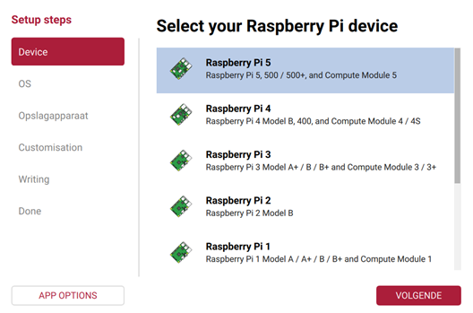
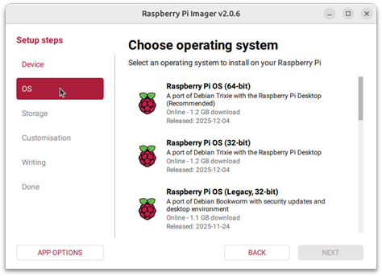
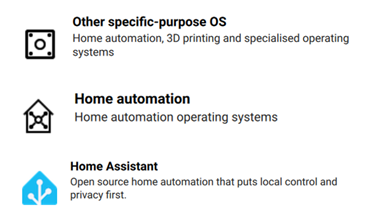
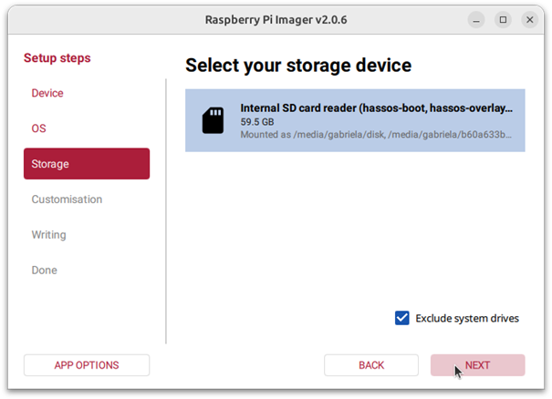
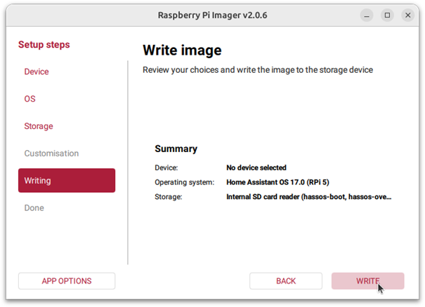

# Handleiding

## Inhoudstafel 
[**HomeAssistant installeren op Raspberry Pi**](#homeassistant-installeren-op-raspberry-pi)

[**Code toevoegen op Esp32**](#code-toevoegen-op-esp32)

[**yamle code in home assitant**](#yamle-code-in-home-assitant)

[**Nieuw bed of kamer toevoegen aan de website**](#nieuw-bed-of-kamer-toevoegen-aan-de-website)


## HomeAssistant installeren op Raspberry Pi
### Inhoud

In dit onderdeel zal stap voor stap uitgelegd worden hoe wij HomeAssistant op een Raspberry Pi hebben gezet.

### Benodigdheden

- Raspberry Pi (wij gebruikten versie 5)

- Power supply

- Micro SD card (min. 32 GB)

- SD card lezer

- Ethernet kabel

- Laptop

### Uitvoering

#### Installeren op Raspberry Pi

1. Als de Raspberry Pi Imager nog niet geïnstalleerd is, download en installeer deze dan op uw computer zoals beschreven onder [https://www.raspberrypi.com/software/](https://www.raspberrypi.com/software/).

2. Onder device selecteer het toestel die u zal gebruiken (in ons geval versie 5).
   <div style="display: flex; gap: 10px;">
   
</div>

3. Klik daarna op volgende.
   <div style="display: flex; gap: 10px;">
   
</div>

4. Selecteer **Other specific-purpose OS** > **Home automation** > **Home Assistant**.
   <div style="display: flex; gap: 10px;">
   
</div>

5. Kies het Home Assistant-besturingssysteem dat overeenkomt met het gebruikte hardware (voor ons RPi 5).

6. Kies de opslagplaats:

- Plaats de SD-kaart in de computer. Wees zeker dat de inhoud weg mag want de **inhoud** van de kaart wordt **overschreven**.

- Selecteer uw SD-kaart.
  <div style="display: flex; gap: 10px;">
   
</div>

7. Schrijf het installatieprogramma naar de SD-kaart:

- Om het proces te starten, selecteert u **Volgende** en vervolgens **Schrijven**.

- Wacht tot het Home Assistant OS naar de SD-kaart is geschreven.
  <div style="display: flex; gap: 10px;">
   
</div>

8. Selecteer **Finish** en werp de SD kaart uit.

#### Opstarten Raspberry Pi

- Plaats de SD-kaart in uw Raspberry Pi.

- Sluit een ethernetkabel aan en zorg ervoor dat de Raspberry Pi is aangesloten op hetzelfde netwerk als uw computer en verbinding heeft met internet.

- Sluit de voeding aan om het apparaat op te starten.

#### Toegang tot HomeAssistant

Binnen enkele minuten na het aansluiten van de Raspberry Pi kunt kan het nieuwe Home Assistant bereikt worden.

Er zijn 2 manieren om op de pagina te geraken.

1. Voer in de browser van uw desktopsysteem [homeassistant.local:8123](http://homeassistant.local:8123/) in.

	Op deze manier kan je echter op een verkeerde pagina terecht komen (van een ander toestel).

2. Om zeker te zijn dat de juiste pagina wordt bereikt vul dan http://X.X.X.X:8123 (vervang X.X.X.X door het IP-adres van je Raspberry Pi) in een browser.

Om het IP-adres van je Raspberry Pi uit te lezen gebruik je een HDMI kabel en verbind u deze met de Raspberry Pi en een monitor. Na een aantal seconden zou de console output van de Raspberry Pi zichtbaar moeten worden. Hierbij staat ook het IP-adres.


**Bronnen:**

Handleiding

[Raspberry Pi - Home Assistant](https://www.home-assistant.io/installation/raspberrypi/)


## Code toevoegen op Esp32

Om de code te zetten moet je eerst in arduino ide de juiste code file openen namelijk deze: [code ledstrip](/software/ledProgramma's/ledstrip/ledstrip.ino). Eenmaal je deze code hebt geselecteerd moet je nog een paar instellingen in arduino ide instellen zodat je apparaat zeker als een een zigbee aparaat werkt. Dit vind je in deze file: [instellingen arduino](/software/ledProgramma's/arduino_instellingen.md)


## yamle code in home assitant
De yaml code's zijn puur voor in de automatiseringen te plaatsen hoe je een eerste automatisering aanmaaken en ook nog helpers de info hierover  bevind zich in deze file: [automatisering aanmaken](/software/Homa%20assistant/Helpers%20en%20Automatisering%20.md). Eenmaal je dit hebt gedaan kun je ze plakken in de juiste automatiseringen en ben je klaar met de automatisering van knop naar ledstrip. 

## Nieuw bed of kamer toevoegen aan de website

Als je een nieuwe knop/bed of een volledig nieuwe kamer wilt zichtbaar maken op de website, moet je drie dingen aanpassen: de HTML-pagina, het databestand op de server en (optioneel) Home Assistant. Het JavaScript-bestand `script.js` hoef je **nooit** aan te passen — dat werkt automatisch met alle bed-IDs die de backend teruggeeft.

### Situatie 1: Extra bed toevoegen aan een bestaande kamer

Voorbeeld: een 5e bed toevoegen aan kamer C302.

#### Stap 1 — `frontend/index.html`

Zoek het blok van de kamer. Dat ziet er zo uit:

```html
<article class="card room-card">
    <div class="card-top">
        <div>
            <p class="room-name">Kamer C302</p>
            <p class="room-subtitle">4 bedden</p>   <!-- ← pas dit getal aan -->
        </div>
        ...
    </div>

    <div id="bedsC302" class="bed-grid">
        <!-- bestaande bedden staan hier -->

        <!-- voeg dit blok toe voor het nieuwe bed: -->
        <div class="bed free" id="C302_5">
            <div class="bed-label">Bed 5</div>
            <div class="bed-status">
                <i class="fa-solid fa-circle-check"></i>
                <span>Geen melding</span>
            </div>
        </div>

    </div>
</article>
```

Pas ook de subtitel aan: `4 bedden` → `5 bedden`.

Het `id`-attribuut van het nieuwe `<div>`-blok moet exact overeenkomen met de naam die je in stap 2 gebruikt: `C302_5`.

#### Stap 2 — `backend/data/rooms.json` (op de VM)

Open het bestand `rooms.json` en voeg het nieuwe bed toe:

```json
{
  "beds": {
    "C302_1": "idle",
    "C302_2": "idle",
    "C302_3": "idle",
    "C302_4": "idle",
    "C302_5": "idle",   ← nieuw
    "C314_1": "idle",
    ...
  }
}
```

Sla het bestand op. De server hoeft niet herstart te worden.

#### Stap 3 — Home Assistant

Volg de stappen in [Helpers en Automatisering](/software/Home%20assistant/Helpers%20en%20Automatisering%20.md) om een nieuwe `input_select` helper aan te maken voor het nieuwe bed (bijv. `input_select.bed5_c302`) en koppel de bijbehorende knop eraan via een automatisering.

---

### Situatie 2: Volledig nieuwe kamer toevoegen

Voorbeeld: kamer C320 toevoegen met 3 bedden.

#### Stap 1 — `frontend/index.html`

Voeg een nieuw `<article>`-blok toe binnen `<section class="card-container">`, na de bestaande kamers:

```html
<article class="card room-card">
    <div class="card-top">
        <div>
            <p class="room-name">Kamer C320</p>
            <p class="room-subtitle">3 bedden</p>
        </div>
        <div class="room-badge">
            <i class="fa-solid fa-bed-pulse"></i>
            <span>Actieve monitoring</span>
        </div>
    </div>

    <div id="bedsC320" class="bed-grid">
        <div class="bed free" id="C320_1">
            <div class="bed-label">Bed 1</div>
            <div class="bed-status">
                <i class="fa-solid fa-circle-check"></i>
                <span>Geen melding</span>
            </div>
        </div>

        <div class="bed free" id="C320_2">
            <div class="bed-label">Bed 2</div>
            <div class="bed-status">
                <i class="fa-solid fa-circle-check"></i>
                <span>Geen melding</span>
            </div>
        </div>

        <div class="bed free" id="C320_3">
            <div class="bed-label">Bed 3</div>
            <div class="bed-status">
                <i class="fa-solid fa-circle-check"></i>
                <span>Geen melding</span>
            </div>
        </div>
    </div>
</article>
```

#### Stap 2 — `backend/data/rooms.json` (op de VM)

Voeg alle bedden van de nieuwe kamer toe:

```json
{
  "beds": {
    "C302_1": "idle",
    ...
    "C320_1": "idle",   ← nieuw
    "C320_2": "idle",   ← nieuw
    "C320_3": "idle"    ← nieuw
  }
}
```

#### Stap 3 — Home Assistant

Maak voor elk nieuw bed een `input_select` helper aan en koppel de bijbehorende knop via een automatisering. Zie [Helpers en Automatisering](/software/Home%20assistant/Helpers%20en%20Automatisering%20.md) en [MQTT en apparaten toevoegen](/software/Home%20assistant/MQTT%20en%20apparaten%20toevoegen.md).

---

### Naamgeving — belangrijk

De ID die je gebruikt in de HTML (`id="C302_5"`) moet exact hetzelfde zijn als:

- de sleutel in `rooms.json` (`"C302_5": "idle"`);
- de `bedId` die Home Assistant verstuurt naar de website via `POST /api/call`.

Als één van de drie niet overeenkomt, zal de statuskleur op de website niet bijwerken.
