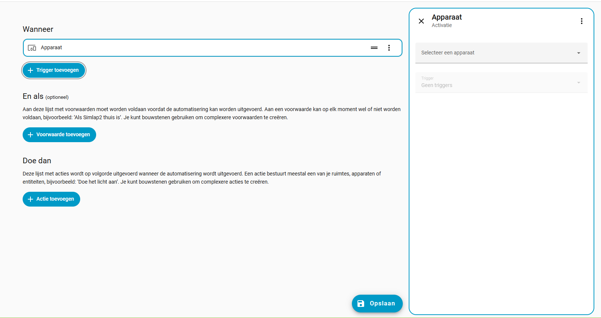

# Helpers Toevoegen

We maken gebruik van Helpers om zo goed te communiceren met de website voor het meldingsysteem. 

## Helpers maken

Om een helper aan te maken ga je naar instellingen → Apparaten en diensten 

Dan selecteer je het tablad bovenaan naar helper.

Dan klik je onderaan op helper aanmaken.

Dan ga je in de lijst zoeken naar keuzeliijst kies je een naam best in het formaat Bed..._C... zodat je makelijk in je automatisering de namen zelf kunt aanpassen zonder te kopiëren. 
Daarna ga je bij opties er 4 toevoegen namelijk: idle,present, call en extra.

# Automatisering Toevoegen(dit is een testvoorbeeld maar gebruiken we niet)

Dit moet worden gedaan omdat de knop en de ESP met ledstrip twee aparte apparaten zijn en dus niet rechtstreeks met elkaar kunnen 
verbinden. Daarom wordt er gebruikgemaakt van een automatisering die bepaalt: als dit gebeurt, moet dat worden uitgevoerd.

## Automatisering maken 

In Home Assistant ga je naar Instellingen → Automatiseringen en scènes, en klik je vervolgens bovenaan op Scènes.

Je komt standaard op het automatiseringsblad terecht, dus druk je rechtsonder op ‘Automatisering toevoegen’.

Op het tweede scherm klik je op ‘Automatisering toevoegen’ en daarna krijg je dit scherm te zien.

Het eerste wat je doet, is een trigger aanmaken voor de knop. Klik hiervoor op ‘Trigger toevoegen’ en kies ‘Apparaat’. Daarna 
verschijnt dit scherm.

Daarna ga je in de lijst zoeken naar het apparaat dat je wilt gebruiken voor de trigger. In ons geval is dit de eWeLink SNZB-01P. 
Selecteer dit apparaat. Vervolgens moet je de trigger kiezen; in dit geval kiezen we voor "Drukknop" knop ingedrukt. Dan moet je 
dit zien staan. 

De volgende stap is het toevoegen van een actie. Klik op ‘Actie toevoegen’ en kies ‘Scène toevoegen’. Selecteer daarna ‘Inschakelen’. Vervolgens klik je op ‘Doel toevoegen’ en kies je de gewenste scène; in ons geval is dat ‘demo’.
 

Daarna hoef je enkel nog de automatisering op te slaan en een naam naar keuze te geven. Vervolgens is de automatisering klaar 
voor gebruik.

## Automatisering uitzetten(dit moet je maar doen bij 1 van de drie automatiseringen)
Nu heb je wel het probleem dat je de scène kunt aanzetten, maar nog niet kunt uitzetten. Hiervoor moet je een kleine aanpassing 
doen in je demo.
Als je meerdere scènes gebruikt die je met één drukknop inschakelt, hoef je maar één keer een uit-functie te maken om alle scènes 
die je hebt uit te schakelen.

Bij ‘Actie toevoegen’ ga je nu bovenaan naar ‘Bouwstenen’ en kies je ‘Als-dan voorwaarde’.
Bij ‘Als’ voeg je het apparaat unk_manufacturer unk_model toe en stel je in dat het uitgeschakeld is.
Daarna voeg je bij ‘Dan’ de instelling ‘Scène toevoegen’ toe en selecteer je de gewenste scène.
Vervolgens voeg je bij ‘Anders’ de actie toe om unk_manufacturer unk_model uit te zetten.

