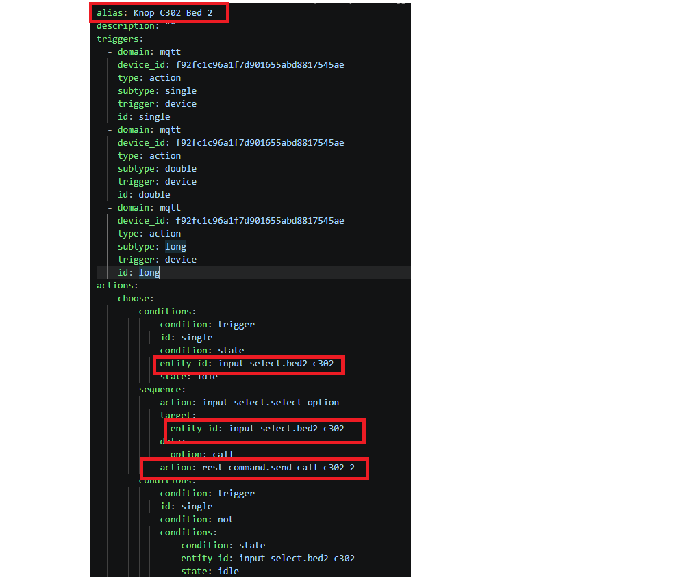
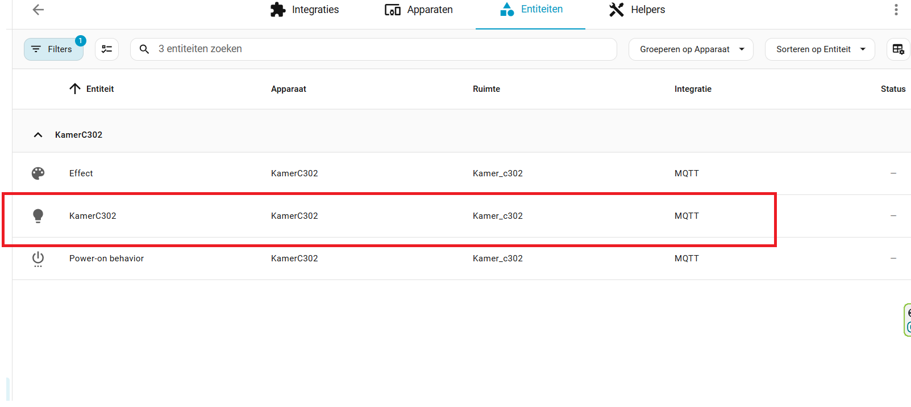

# YAML-bestanden Gebruiken

De meegeleverde YAML-bestanden bevatten de automatiseringen die je in Home Assistant moet aanmaken. In principe kun je deze in de interface visueel aanmaken, maar rechtstreeks de YAML-code bewerken is een stuk sneller. In deze map vind je twee submappen, namelijk voor kamer C302 en C305. Dit zijn de voorgemaakte YAML-bestanden voor de knoppen en Master Ledstrip in de betreffende kamer. Om deze bestanden voor jouw opstelling correct te laten werken, moet je enkele parameters aanpassen. Hieronder lees je precies hoe je dit doet.

## Knoppen

### ID aanpassen 

Iedere Zigbee-knop heeft een uniek apparaat-ID (Device ID). Om ervoor te zorgen dat de automatisering reageert op de juiste fysieke knop, moet je deze ID in het YAML-bestand op drie specifieke plaatsen invullen.

Je kunt dit apparaat-ID vinden in Home Assistant zodra je de knop succesvol hebt toegevoegd. Navigeer naar de apparaatpagina van deze specifieke knop en bekijk de URL in de zoekbalk van je browser; het lange nummer is je ID.

### Namen aanpassen 
De entiteitsnamen (`entity_id`) in de code moeten overeenkomen met de specifieke "Helper" (`input_select`) die je per bed hebt aangemaakt. Dit proces wordt stap voor stap uitgelegd in de handleiding [Helper aanmaken](/software/Homa%20assistant/Helpers%20en%20Automatisering%20.md). 
Controleer de naam van je helpers en vul deze in onder `entity_id`. Let er ook op dat je het REST-API commando bij `action` aanpast naar het logische formaat voor jouw project, oftewel: lokaal en bednummer (bijv. `rest_command.send_call_c302_1`).

## Master Ledstrip

Per kamer is er bovendien één `ledstrip.yml` bestand dat als "Master" dient. Deze logica plak je ook in een nieuwe automatisering en stuur je aan door de juiste namen en ID's te koppelen.

### ID aanpassen 
Iedere ledstrip-controller krijgt vanuit Zigbee2MQTT of Home Assistant een unieke Entiteit-ID toegewezen. Vul deze ID op vier plaatsen in de YAML-code in `target -> entity_id` in, zodat de juiste lamp gaat branden.

Je vindt de exacte entiteitsnaam van de ledstrip als volgt: 
Navigeer naar **Instellingen** → **Apparaten & Diensten** → **MQTT** en klik op je ledstrip-apparaat in de bestemde kamer. Klik vervolgens op het lamp/schakelaar-icoontje bij bediening, open het instellingen-tandwieltje rechtsboven in de pop-up en kopieer vanaf daar de "Entiteit-ID" (meestal beginnend met `light.`).

### Bedden toevoegen
De ledstrip-code is ontworpen om makkelijk op te schalen. Als je een nieuw bedbed aan de kamer toevoegt, voeg je gewoon eenvoudig de naam van de nieuwe helper toe aan de lijst onder de `triggers` en `variables`. De prioriteit (`extra`, `call`, `present`) van alle opgesomde bedden wordt dan automatisch foutloos berekend!

