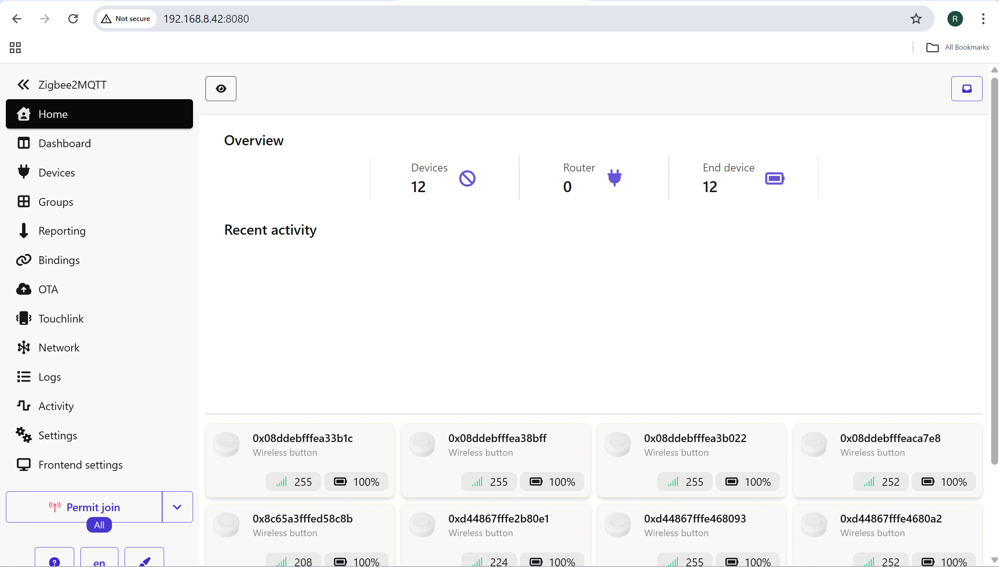
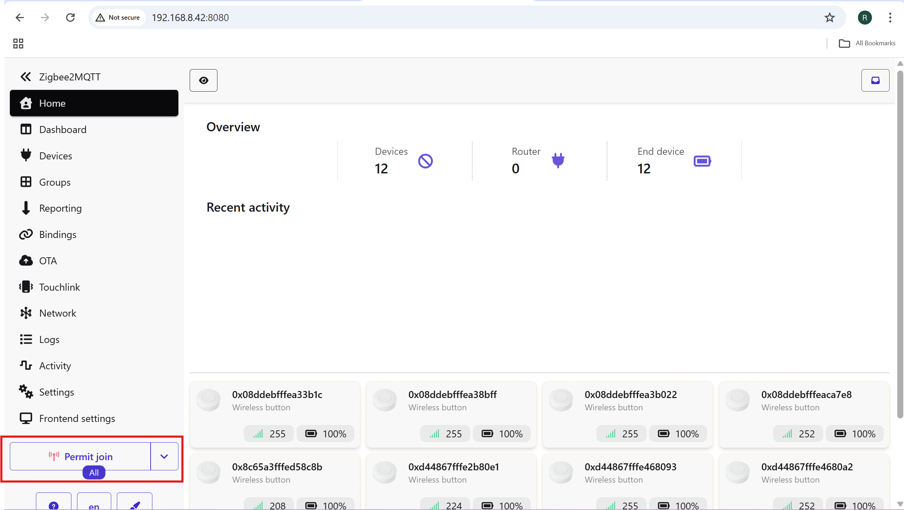
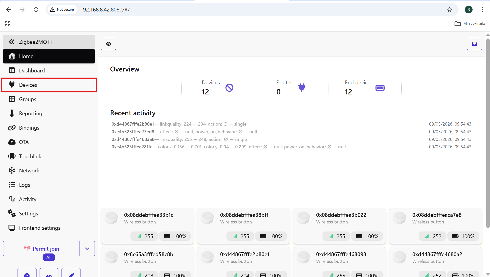
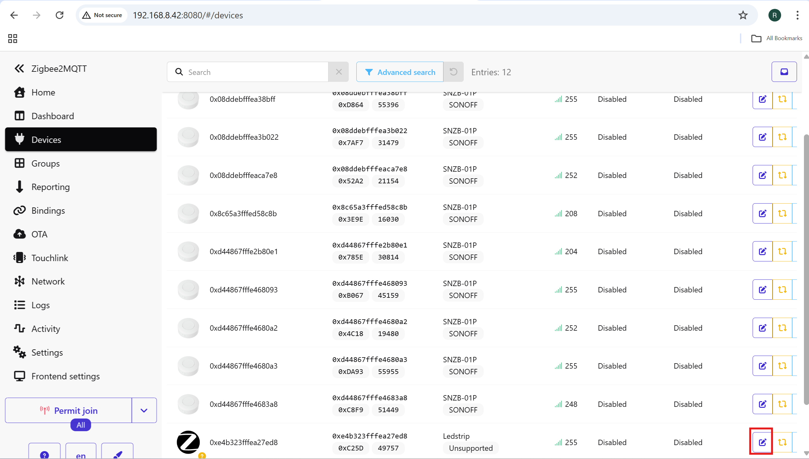
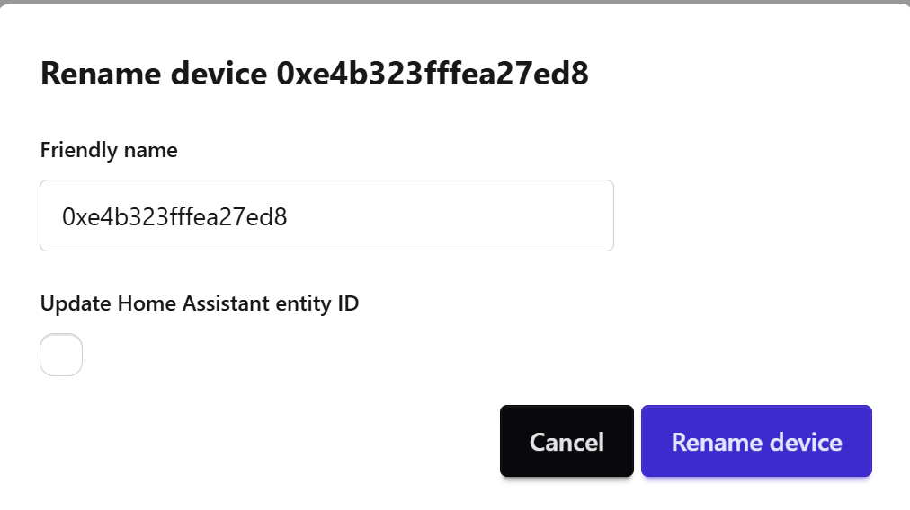
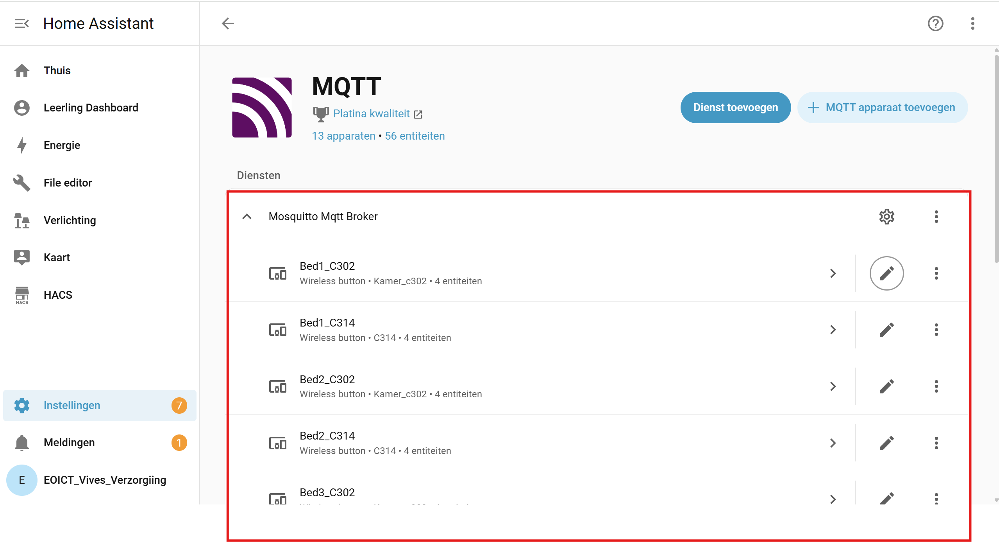
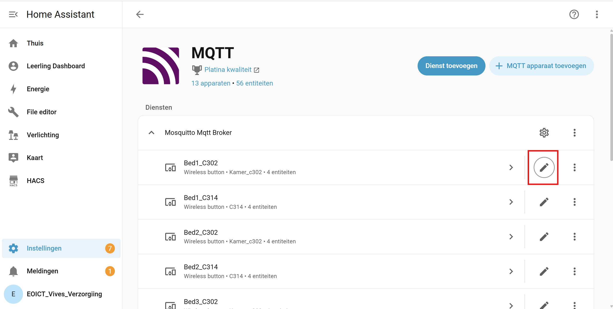
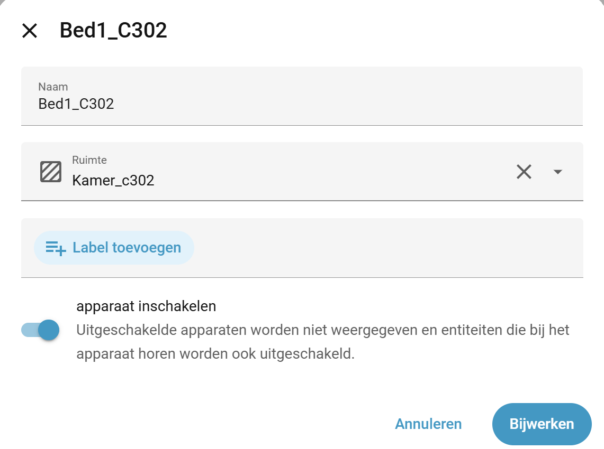

# Apparaten toevoegen in Home Assistant via Zigbee2MQTT 

Deze handleiding beschrijft hoe je MQTT controleert in Home Assistant en hoe je via Zigbee2MQTT Zigbee-apparaten toevoegt.

## Stap 1 instellingen

Ga op het beginscherm van Home Assistant naar Instellingen (linksonder).

## Stap 2 apparaten en diensten

Klik op Apparaten en diensten.

## Stap 3 kijken of MQTT al aanwezig is of toevoegen

1. Controleer of MQTT al in de lijst staat  
    

2. Staat deze er niet? Klik rechtsonder op Integratie toevoegen  
    

3. Zoek naar MQTT en klik erop  
    

4. Dan kom je op dit scherm en klik op het bovenste MQTT  
    

5. Dan krijg je een scherm waar je de broker/server, username en password kan invullen
   - Broker/server: `<broker-ip>`
   - Poort: `1883` (standaard MQTT poort)
   - Username: `<username>`
   - Password: `<password>`

6. Na de installatie zou MQTT in de lijst met integraties moeten staan

## Stap 4

Ga naar `http://<ip-van-de-pi>:8080` (de webinterface van Zigbee2MQTT)

Voorbeeld:
http://192.168.8.42:8080

(Belangrijk: je moet op dezelfde wifi zitten als je Pi)

Dan zou je op dit scherm moeten komen.

## Stap 5 Permit Join aanzetten in Zigbee2MQTT

Klik linksonder op de knop Permit Join 

Controleer of "Permit Join" nog actief is.
Deze knop schakelt automatisch terug uit na een bepaalde tijd.

## Stap 6 Zet je apparaten in koppelmodus

### ESP32 in koppelmodus zetten

Zorg er eerst voor dat de juiste code erop staat.
In de code moet ingesteld zijn dat de ESP32 automatisch probeert te verbinden na een reset.

Als deze functie in de code aanwezig is, druk dan op de resetknop van de ESP32.
De ESP32 zal daarna automatisch proberen te verbinden met Zigbee2MQTT.

### SONOFF Zigbee Wireless Switch in koppelmodus zetten

Aan de zijkant van de knop zit een klein rond knopje.
Hou dit knopje ongeveer 5 seconden ingedrukt.

## Stap 7 apparaten controleren

Wacht tot het apparaat verschijnt in de Zigbee2MQTT pagina.

Als alles correct werkt, zou het apparaat hier moeten verschijnen.

## Stap 8 apparaatnaam wijzigen in Zigbee2MQTT

Je kan ervoor kiezen om de naam van het apparaat te veranderen in Zigbee2MQTT.

Klik hiervoor op Devices links op je scherm.

Dan kom je op deze pagina.
Klik daar op het blauwe icoontje.

Dan kom je op dit scherm.

Hier kan je de naam veranderen naar wat je wilt.
Hier kan je ook op het vakje klikken (Update Home Assistant entity ID).

Dan probeert Zigbee2MQTT ook de Home Assistant entity IDs mee te veranderen.

### Opgelet:

Als je al apparaten hebt gebruikt in Home Assistant code en je gaat nu de naam aanpassen in Zigbee2MQTT, kan dit ervoor zorgen dat de bestaande Home Assistant automations niet meer werken.

Daarom wordt aangeraden om namen enkel in Home Assistant aan te passen of eerst de naam aan te passen in Zigbee2MQTT voordat je het apparaat gebruikt in Home Assistant.

## Stap 9 apparaat controleren in Home Assistant

Controleer of je apparaat zichtbaar is in Home Assistant.

Ga naar Instellingen.
Klik op Apparaten en diensten.
Klik op MQTT.
Kijk of hier je apparaat staat.

Als je apparaat daar staat, is het in orde.

## Stap 10 naam aanpassen in Home Assistant + apparaat aan een kamer toevoegen

Klik rechts op het potloodicoon.

Dan kom je op dit scherm.

Hier kan je de naam van het apparaat aanpassen voor in Home Assistant.
Je kan het apparaat hier ook aan een kamer toevoegen.

## Problemen oplossen

### 1. Apparaat wordt niet gevonden

1. Controleer of je apparaat in koppelmodus staat  
   (raadpleeg de handleiding van je apparaat om te zien hoe dit moet)

2. Zet het apparaat dichter bij je Zigbee stick

3. Probeer het apparaat eerst te resetten

### 2. Nog steeds problemen met toevoegen?

1. Herstart Home Assistant  
   → Zet Home Assistant even uit en weer aan

2. Trek je Zigbee stick uit en steek hem opnieuw in  
   → Haal de stick uit de Raspberry Pi en steek hem opnieuw in

3. Zoek hulp online  
   → Raadpleeg de handleiding van je apparaat of zoek op forums

4. Controleer of MQTT verbonden is  
   → Controleer in Home Assistant of de MQTT integratie actief is.

5. Controleer of Zigbee2MQTT bereikbaar is

   Open:  
   `http://<ip-van-de-pi>:8080`

   Controleer of de Zigbee2MQTT webinterface correct opent.

